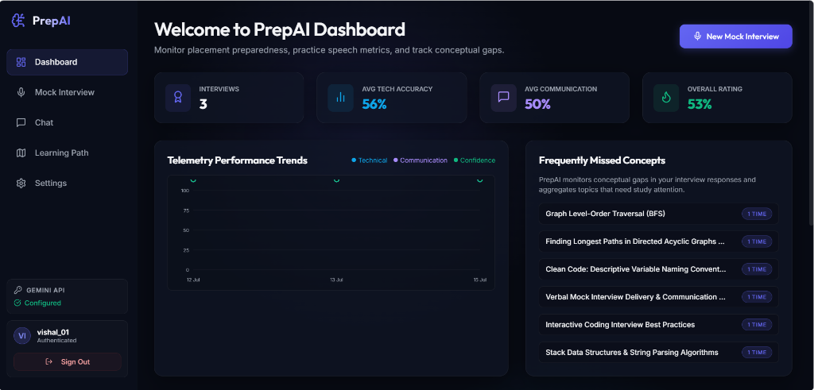
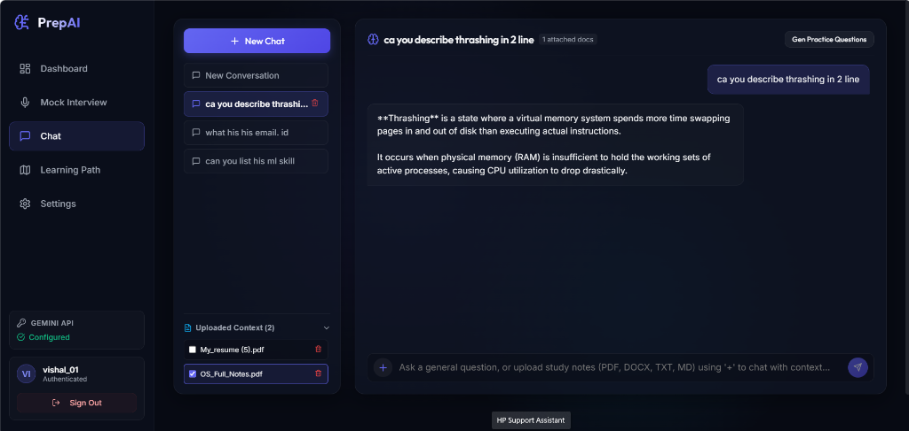
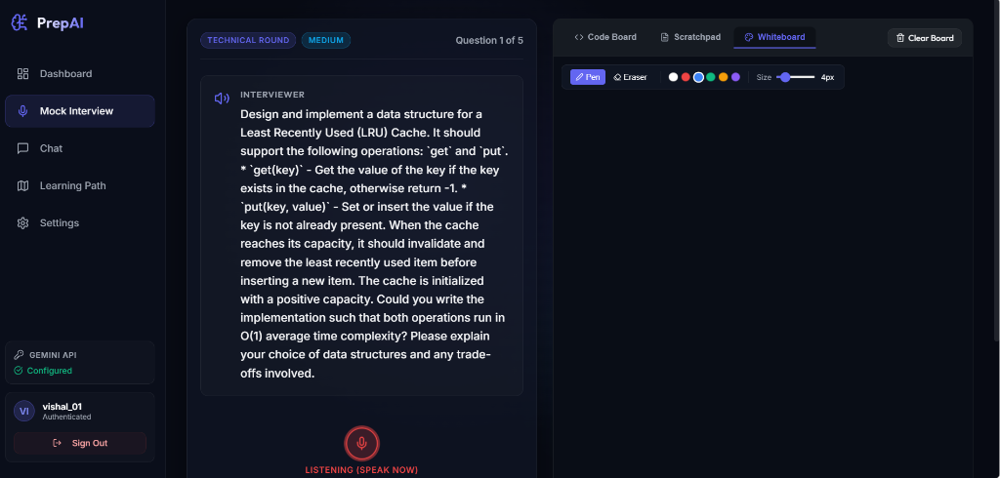
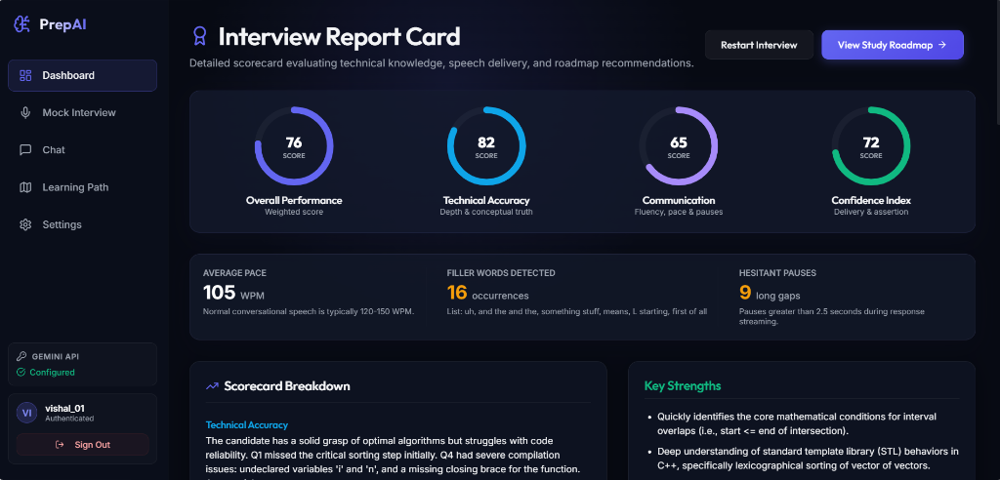
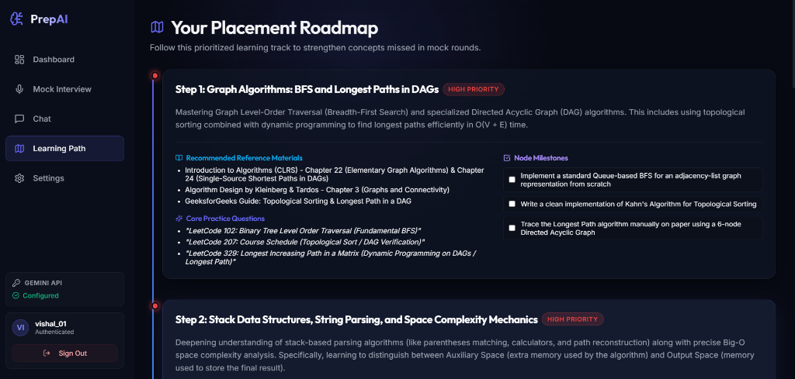

<div align="center">

# PrepAI

### Adaptive AI Interview & Career Preparation Platform

[](https://react.dev)
[](https://vite.dev)
[](https://expressjs.com)
[](https://mongoosejs.com)
[](https://ai.google.dev)
[](LICENSE)

An AI-powered placement preparation platform that combines **RAG-based document Q&A**, **adaptive mock interviews**, **automated code evaluation**, and a **personalized learning roadmap** — all driven by Google's Gemini API.

[**Live Demo**](#) · [**Report Bug**](#) · [**Request Feature**](#)

</div>

---

## 📑 Table of Contents

- [✨ Features](#-features)
- [🖼️ Screenshots](#-screenshots)
- [🏗️ Architecture](#-architecture)
- [🧰 Tech Stack](#-tech-stack)
- [📁 Project Structure](#-project-structure)
- [🚀 Getting Started](#-getting-started)
- [⚙️ Environment Variables](#-environment-variables)
- [📜 Available Scripts](#-available-scripts)
- [🔌 API Reference](#-api-reference)
- [☁️ Deployment](#-deployment)
- [🛣️ Roadmap](#-roadmap)
- [🤝 Contributing](#-contributing)
- [📄 License](#-license)
- [👤 Author](#-author)
- [🙏 Acknowledgments](#-acknowledgments)

---

## ✨ Features

### 🎤 Adaptive Mock Interviews
- **Multiple interview types:** HR, Technical, DSA (coding), and System Design
- **Configurable difficulty:** Easy / Medium / Hard
- **Dynamic follow-up questions** generated by Gemini based on the candidate's response
- **Adjustable question count** per interview (e.g. 3 for DSA, 6–10 for Technical)
- **RAG-augmented question generation** that grounds questions in the user's uploaded study material

### 📊 AI-Powered Evaluation
- **Multi-dimensional scoring:** overall, technical, communication, confidence (0–100)
- **Detailed feedback per question** with strengths, weaknesses, and improvement suggestions
- **Speech analytics:** filler-word count, speaking pace (WPM), and long-pause detection
- **Auto-generated weak-topic list** that feeds the learning roadmap

### 💻 Code Workspace
- **In-browser coding editor** with multi-language support
- **AI judge** that evaluates correctness, complexity (time/space), and code quality
- **Simulated stdout** for DSA problem test runs

### 📚 RAG Document Assistant
- **Upload PDF / DOCX / TXT / MD** study materials
- **Cloudinary** for durable raw-file storage
- **Custom text chunking + Gemini embeddings** for vector search
- **Persistent chat threads** scoped to selected documents
- **Auto question generation** from uploaded notes

### 🗺️ Personalized Learning Roadmap
- **Automatically built** from each completed interview's weak topics
- **Per-topic priority, concept summary, study resources, practice questions, and pre-tasks**
- **Tracked prep tasks** to mark progress

### 🔐 Security
- **JWT authentication** with HTTP-only cookies
- **bcrypt** password hashing
- **AES-256-CBC encryption** for per-user Gemini API keys at rest
- **Environment-driven CORS allowlist** for production
- **User-scoped data** — every query is filtered by `userId`

---

## 🖼️ Screenshots

| Dashboard | Mock Interview | RAG Assistant |
| --- | --- | --- |
|  |  |  |

| Coding Workspace | Evaluation Report | Learning Roadmap |
| --- | --- | --- |
|  |  |  |

---

## 🏗️ Architecture

```
┌────────────────────────┐         ┌──────────────────────────────────────┐
│   React 19 + Vite SPA  │  HTTPS  │  Node.js / Express API (server.js)  │
│  (frontend/dist built) │ ◀────▶  │                                      │
│  - React Router-less   │  /api/* │  - JWT auth (HTTP-only cookies)     │
│  - Tab-based views     │         │  - AES-256 API-key encryption       │
│  - Runtime fetch patch │         │  - RAG pipeline (chunk → embed)     │
│  - LocalStorage cache  │         │  - Multer file upload (10MB)        │
└────────────────────────┘         │  - Serves dist/ in production       │
                                   └──────────────┬───────────────────────┘
                                                  │
                ┌─────────────────────────────────┼─────────────────────────┐
                │                                 │                         │
                ▼                                 ▼                         ▼
        ┌───────────────┐                ┌───────────────┐         ┌────────────────┐
        │   MongoDB     │                │  Cloudinary   │         │ Google Gemini  │
        │  (Mongoose)   │                │  (file store) │         │   API (LLM +   │
        │               │                │               │         │  embeddings)   │
        └───────────────┘                └───────────────┘         └────────────────┘
```

**RAG flow:**
1. User uploads PDF/DOCX/TXT → Multer buffer → Cloudinary (raw) + text extraction (`pdf-parse` / `mammoth`).
2. Text is **chunked** (`server/rag.js`).
3. Chunks are **embedded** with Gemini's embedding model.
4. On a chat query, the user query is embedded and a **cosine-similarity search** is run over the user's chunks.
5. Top-K chunks are passed as context to Gemini for a grounded response.

---

## 🧰 Tech Stack

| Layer        | Technology                                                                 |
| ------------ | -------------------------------------------------------------------------- |
| Frontend     | React 19, Vite 8, Lucide React, Canvas Confetti                            |
| Backend      | Node.js, Express 4, Mongoose 9, Multer, JWT, bcrypt, cookie-parser, CORS  |
| AI / RAG     | `@google/generative-ai` (Gemini 1.5 Flash + Embeddings), custom chunker    |
| File parsing | `pdf-parse`, `mammoth` (DOCX)                                              |
| Storage      | MongoDB (Atlas or local), Cloudinary (raw file uploads)                    |
| Tooling      | npm workspaces-style root scripts, `concurrently`, Oxlint                   |

---

## 📁 Project Structure

```
placement-interview/
├── backend/
│   ├── server/
│   │   ├── db.js          # Mongoose data-access layer (CRUD helpers)
│   │   ├── models.js      # Schemas: User, Document, Chunk, Thread, Message, Interview, Roadmap
│   │   └── rag.js         # Chunking, embedding, semantic search
│   ├── server.js          # Express app: auth, documents, RAG, interviews, roadmap
│   ├── package.json
│   └── package-lock.json
├── frontend/
│   ├── src/
│   │   ├── components/    # Auth, Navbar, Dashboard, MockInterview, RAGAssistant,
│   │   │                  # CodingWorkspace, LearningRoadmap, EvaluationReport, Settings
│   │   ├── App.jsx        # Tab-based view switcher + session bootstrap
│   │   ├── main.jsx       # React entry + global fetch interceptor (VITE_API_BASE_URL)
│   │   ├── index.css
│   │   └── App.css
│   ├── index.html
│   ├── vite.config.js     # /api proxy → http://localhost:5000 in dev
│   └── package.json
├── package.json           # Root: install:all, dev, build, start
├── .env.example           # Template for all env vars
├── .gitignore
└── README.md
```

---

## 🚀 Getting Started

### Prerequisites

- **Node.js** ≥ 18 (Node 20 LTS recommended)
- **npm** ≥ 9
- **MongoDB** — local install **or** a free [MongoDB Atlas](https://www.mongodb.com/atlas) cluster
- **Google Gemini API key** — get one at [aistudio.google.com](https://aistudio.google.com/app/apikey)
- **Cloudinary account** (optional) — for production-grade file storage; without it, the app falls back to a mock URL

### 1. Clone & install

```bash
git clone https://github.com/<your-username>/prepai.git
cd prepai
npm run install:all
```

This installs root, `frontend/`, and `backend/` dependencies in one shot.

### 2. Configure environment

```bash
cp .env.example .env
# Edit .env with your real values (see "Environment Variables" below)
```

### 3. Run in development

```bash
npm run dev
```

This starts **both** the backend (`:5000`) and frontend (`:5173`) with hot-reload via `concurrently`.

Open <http://localhost:5173> and create an account.

### 4. Build for production

```bash
npm run build          # builds frontend → frontend/dist
npm start              # node backend/server.js  (serves API + dist/)
```

---

## ⚙️ Environment Variables

All variables live in a single root `.env` (loaded by `dotenv` from both the backend cwd and the repo root).

| Variable                  | Required | Default                | Description                                                                 |
| ------------------------- | -------- | ---------------------- | --------------------------------------------------------------------------- |
| `PORT`                    | No       | `5000`                 | Express server port. Render/Railway set this automatically — keep `|| 5000`. |
| `MONGODB_URI`             | **Yes**  | —                      | MongoDB connection string. Atlas example: `mongodb+srv://<user>:<pass>@...`  |
| `JWT_SECRET`              | **Yes**  | —                      | Secret used to sign JWTs and derive the AES key. Use a long random string.  |
| `GEMINI_API_KEY`          | No       | —                      | Server-side fallback key. Users can also set their own in **Settings**.      |
| `CLOUDINARY_CLOUD_NAME`   | No       | —                      | Cloudinary cloud name.                                                       |
| `CLOUDINARY_API_KEY`      | No       | —                      | Cloudinary API key.                                                          |
| `CLOUDINARY_API_SECRET`   | No       | —                      | Cloudinary API secret.                                                       |
| `VITE_API_BASE_URL`       | No       | _(empty)_              | Frontend: prepend this to every `/api*` call. Use for separate frontend hosting. |
| `FRONTEND_URL`            | No       | `http://localhost:5173`| Comma-separated CORS allowlist. Include your production frontend URL.        |
| `NODE_ENV`                | No       | `development`          | Set to `production` to enable static-file serving of `frontend/dist`.        |

> ⚠️ **Never commit a real `.env` file.** The included `.gitignore` already excludes it.

---

## 📜 Available Scripts

Run from the **root** unless noted.

| Script                  | What it does                                                              |
| ----------------------- | ------------------------------------------------------------------------- |
| `npm run install:all`   | Installs root, `frontend/`, and `backend/` dependencies in sequence.      |
| `npm run dev`           | Runs backend + frontend concurrently with hot-reload.                    |
| `npm run dev:backend`   | Backend only: `node backend/server.js` (uses nodemon-style HMR via `node --watch` if you prefer — see Notes). |
| `npm run dev:frontend`  | Frontend only: Vite dev server with HMR.                                  |
| `npm run build`         | Production build of the React app → `frontend/dist`.                      |
| `npm start`             | Production start: `node backend/server.js` (assumes `frontend/dist` exists). |

---

## 🔌 API Reference

All endpoints are prefixed with `/api`. Authentication is via the HTTP-only `token` cookie set on `/api/auth/login` or `/api/auth/signup`. Every route after the auth block requires a valid session.

### Auth
| Method | Path                | Body                          | Description                          |
| ------ | ------------------- | ----------------------------- | ------------------------------------ |
| POST   | `/api/auth/signup`  | `{ username, password }`      | Create account, sets `token` cookie. |
| POST   | `/api/auth/login`   | `{ username, password }`      | Login, sets `token` cookie.          |
| POST   | `/api/auth/logout`  | —                             | Clears `token` cookie.               |
| GET    | `/api/auth/me`      | —                             | Current user (without password).     |
| POST   | `/api/user/api-key` | `{ apiKey }`                  | Save encrypted Gemini key for user.  |

### Documents (RAG)
| Method | Path                     | Description                                            |
| ------ | ------------------------ | ------------------------------------------------------ |
| GET    | `/api/documents`         | List user's documents.                                 |
| POST   | `/api/documents/upload`  | Multipart form-data `file` (PDF/DOCX/TXT/MD, ≤10MB).   |
| DELETE | `/api/documents/:id`     | Delete a document and its chunks.                      |

### RAG Threads
| Method | Path                                  | Description                                |
| ------ | ------------------------------------- | ------------------------------------------ |
| GET    | `/api/rag/threads`                    | List user's threads.                       |
| POST   | `/api/rag/threads`                    | Create a new empty thread.                 |
| GET    | `/api/rag/threads/:id`                | Get a thread (with messages).              |
| DELETE | `/api/rag/threads/:id`                | Delete thread + its documents and chunks.  |
| POST   | `/api/rag/threads/:id/messages`       | Send a user message; returns AI reply.     |
| PUT    | `/api/rag/threads/:id/documents`      | Update the thread's selected documents.    |
| POST   | `/api/rag/generate-questions`         | Generate practice Qs from chunks.          |

### Mock Interviews
| Method | Path                          | Description                                                  |
| ------ | ----------------------------- | ------------------------------------------------------------ |
| GET    | `/api/interviews`             | List user's past interviews.                                 |
| POST   | `/api/interviews/start`       | Start a new interview session.                               |
| POST   | `/api/interviews/answer`      | Submit an answer; advances the session or triggers eval.     |
| POST   | `/api/interviews/end-evaluate`| Force end + evaluation.                                      |
| POST   | `/api/interviews/code-run`    | Evaluate a code submission against a problem statement.     |

### Roadmap
| Method | Path             | Description                                          |
| ------ | ---------------- | ---------------------------------------------------- |
| GET    | `/api/roadmap`   | Get the user's current learning roadmap.             |
| POST   | `/api/clear`     | Wipe all user-scoped data (documents, threads, etc). |

> Full request/response examples are in [`docs/api.md`](docs/api.md) _(TODO)_.

---

## ☁️ Deployment

A single Node process hosts the API **and** the built React SPA. Set `NODE_ENV=production` and the server will serve `frontend/dist/` for any non-`/api` route (SPA history fallback).

### Render (recommended for free tier)

1. Push the repo to GitHub.
2. New → **Web Service** → connect repo.
3. Build command:
   ```bash
   npm run install:all && npm run build
   ```
4. Start command:
   ```bash
   npm start
   ```
5. Add env vars in the Render dashboard (use the table above). Set `FRONTEND_URL` to your actual frontend origin (or your Render URL if serving frontend from the same service).
6. Set `MONGODB_URI` to your Atlas connection string.

### Railway / Fly.io

Same env vars. Point your start command at `npm start` and your build command at `npm run build`. Most platforms auto-set `PORT` — the app already honors that.

### Separate frontend + backend (Vercel + Render, etc.)

1. Deploy backend to Render as above. Note the public URL, e.g. `https://prepai-api.onrender.com`.
2. Deploy frontend to Vercel as a Vite app. Add a Vercel env var:
   - `VITE_API_BASE_URL` = `https://prepai-api.onrender.com`
3. On the backend service, set `FRONTEND_URL` = your Vercel URL.
4. Both services must run over **HTTPS** for the cross-origin `secure; sameSite=none` cookie to work.

> A `Dockerfile` and `render.yaml` are on the roadmap — see the [Roadmap](#-roadmap) section.

---

## 🛣️ Roadmap

- [ ] **Dockerfile** + `render.yaml` for one-click deploys
- [ ] **CI** (GitHub Actions): lint, build, test
- [ ] **Tests** (Vitest for frontend, Supertest for backend)
- [ ] **/health** endpoint for PaaS health checks
- [ ] **Streaming responses** for the RAG chat (SSE)
- [ ] **Voice-mode interview** (real-time STT/TTS)
- [ ] **Resume parser** for personalized question generation
- [ ] **Leaderboard & peer comparison** (opt-in, anonymous)

See the [open issues](#) for the full list of proposed features and known issues.

---

## 🤝 Contributing

Contributions are welcome!

1. Fork the repo.
2. Create your feature branch: `git checkout -b feat/amazing-feature`
3. Commit: `git commit -m "feat: add amazing feature"`
4. Push: `git push origin feat/amazing-feature`
5. Open a Pull Request.

Please follow conventional commits and keep the code style consistent with the existing modules.

---

## 📄 License

Distributed under the **MIT License**. See [`LICENSE`](LICENSE) for the full text.

---

## 👤 Author

**Antigravity** (Google Deepmind Team)

- GitHub: [@google-deepmind](https://github.com/google-deepmind)
- Website: [deepmind.google](https://deepmind.google)

---

## 🙏 Acknowledgments

- [Google Gemini](https://ai.google.dev/) for the LLM + embeddings API
- [Cloudinary](https://cloudinary.com/) for raw file storage
- [Lucide](https://lucide.dev/) for the icon set
- [MongoDB Atlas](https://www.mongodb.com/atlas) for the managed database
- The open-source community behind every package in `package.json`

---

<div align="center">

If this project helped you, please ⭐ star the repo — it means a lot.

</div>
